# Agent-to-Human-Agent
Are you tired of being pinged multiple times per day on Slack, email, phone etc by your coworkers, stakeholders and random people requesting your input and support? Now imagine a world where an AI agent running in the cloud has your contacts and can reach out to ask for support. Do you think it's a nightmare? You might ctually be right, but it's worth trying it anyway :D


This is an experiment to explore how Agent-to-Agent (A2A) communication can work, specifically demonstrating how an AI agent can seamlessly interact with human agents through a proxy system.

## Overview


This project demonstrates a human-in-the-loop workflow where an AI agent (built with Mastra) can pause its execution, request help from a human agent, and automatically resume when the human responds. The system uses the A2A protocol to bridge the gap between automated AI agents and human oversight.

## Architecture

The system consists of three main components:

1. **Mastra A2A Agent** (`mastra-a2a-agent/`) - A CLI-based AI agent that can contact human agents
2. **Human Agent Proxy** (`human-agent-proxy/`) - An A2HA server that manages tasks and routes messages
3. **Fake Slack** (`fake-slack/`) - A demo UI (Next.js app) that simulates a Slack-like interface for human interaction


## How It Works

```mermaid
sequenceDiagram
    autonumber
    participant User as 🧑 User (CLI)
    participant Agent as 🤖 Mastra Agent
    participant A2A as 🔄 A2A Client
    participant A2HA as 🌐 A2HA Server
    participant Slack as 💬 Fake-Slack (Demo UI)
    participant Human as 👤 Human Agent

    User->>Agent: Executes command via CLI
    Agent->>A2A: Calls tool `contact-human-agent` with message
    A2A->>A2HA: Invokes A2HA skill (API call with message)
    A2HA->>A2HA: Parses message, creates taskId
    A2HA->>Slack: Sends POST to Fake-Slack with message
    Slack->>Human: Displays message in Fake-Slack UI

    Human->>Slack: Responds to message
    Slack->>A2HA: Sends webhook with response
    A2HA->>A2A: Sends webhook notification (task update)
    A2A->>Agent: Pushes response and resumes agentic loop
    Agent->>User: Displays response and continues execution
```



### Step-by-Step Explanation

1. **The user interacts with the Mastra Agent**
   - The user runs a command on the CLI (e.g., asking a question or performing an action)
   - The Mastra Agent executes as usual, but it realizes it needs human help (for example, to approve an action or clarify data)

2. **The Agent decides to contact a human**
   - It calls a tool called `contact-human-agent`
   - This tool triggers the A2A client, which acts as the communication layer between the agent world (CLI) and the human world (external system like Slack)

3. **A2A client sends the request to A2HA server**
   - The A2A client makes an API request to the A2HA server (Agent-to-Human-Agent server)
   - The message and context are passed along

4. **A2HA server processes and dispatches the message**
   - The A2HA server parses the message and creates a task (an internal representation of this human request)
   - It assigns a taskId and sends the message to the appropriate communication channel — in this case, Fake-Slack (a demo Slack-like UI)

5. **Human sees and responds to the message**
   - The Human Agent receives the message in Fake-Slack
   - They read it and reply through the UI (for example, "Approved" or "Yes, that's correct")

6. **Response is sent back through webhooks**
   - When the human replies, Fake-Slack triggers a webhook back to the A2HA server
   - The A2HA server, upon receiving the response, notifies the A2A client via another webhook tied to the original taskId

7. **A2A client notifies the Mastra Agent**
   - The A2A client receives this notification and pushes it back into the Mastra Agent process
   - The agent resumes the conversation or task with the new human-provided information

8. **The user sees the result**
   - The Mastra Agent prints or logs the human's response in the CLI
   - The agentic loop continues, now incorporating the human's input as part of the reasoning or execution process

### In Short

This system bridges automation (AI agents) and human oversight using a request–response workflow built on:

- **A2A client** → Communication layer for the agent side
- **A2HA server** → Task manager and channel integrator
- **Fake-Slack** → Example human-facing interface

It enables seamless human-in-the-loop workflows where AI agents can pause, ask for help, and resume automatically when humans respond.

## Getting Started

### Prerequisites

- Node.js >= 20.9.0
- npm or yarn

### Installation

1. **Install dependencies for all components:**

```bash
# Install Mastra A2A Agent dependencies
cd mastra-a2a-agent
npm install

# Install Human Agent Proxy dependencies
cd ../human-agent-proxy
npm install

# Install Fake Slack dependencies
cd ../fake-slack
npm install
```

2. **Set up environment variables:**

Create a `.env` file in the `mastra-a2a-agent` directory with your OpenAI API key:

```bash
cd mastra-a2a-agent
echo "OPENAI_API_KEY=your-api-key-here" > .env
```

### Running the System

You need to run all three components simultaneously. Open three terminal windows:

**Terminal 1 - Human Agent Proxy (Port 4000):**
```bash
cd human-agent-proxy
npm run start-server
```

**Terminal 2 - Fake Slack UI (Port 5000):**
```bash
cd fake-slack
npm run dev
```

**Terminal 3 - Mastra A2A Agent CLI:**
```bash
cd mastra-a2a-agent
npm run start:cli
```

## CLI Interaction Example

Once all services are running, you can interact with the agent through the CLI. Here's an example interaction:

```
Welcome to the Agent to Human Agent Proxy CLI!

What would you like to ask to the agent? > I need to contact Alfonso about a technical question

[Agent processes your request...]

[Agent uses get-team-information tool to find available team members]

[Agent uses contact-human-agent tool to send a message]

Waiting for human agent to contact you...

[Meanwhile, in Fake Slack UI at http://localhost:5000]
- A new contact request appears
- Human clicks on it and sees the message
- Human responds: "Sure, I can help with that technical question!"

[Back in CLI]
Received response from human agent: Sure, I can help with that technical question!

Response from team member: Sure, I can help with that technical question!

[Agent continues with the conversation...]
```

### Example Commands

- `"I need to contact Alfonso about a technical question"` - The agent will look up team information and contact Alfonso via Fake Slack
- `"Who is available in the team?"` - The agent will fetch and display team information
- `"Contact the tech lead about an urgent issue"` - The agent will identify the tech lead and send a message
- `"exit"` - Exit the CLI

## Technologies Used

- **Mastra** - AI agent framework
- **A2A SDK** - Agent-to-Agent communication protocol
- **Express** - Web server framework
- **Next.js** - React framework for the demo UI

## Notes

This is an experimental project to explore A2A capabilities. The implementation is simplified for demonstration purposes and may not include production-ready features like authentication, error handling, or scalability optimizations.


